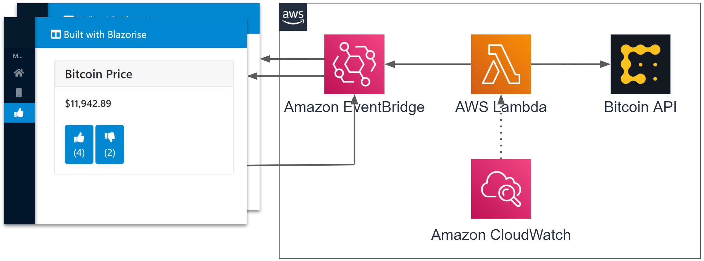
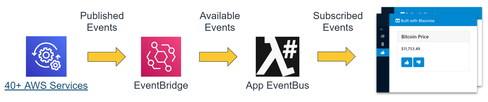
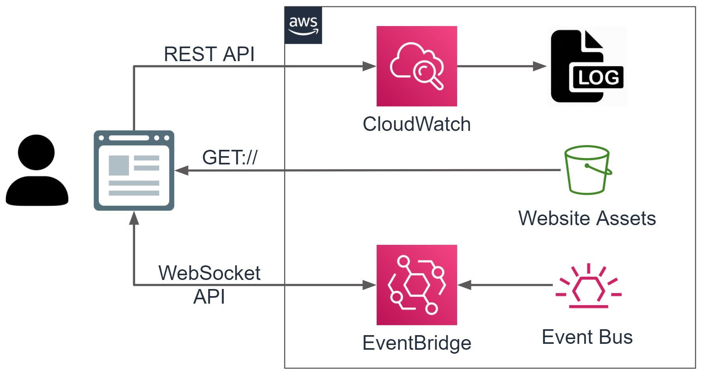

# LambdaSharp - Serverless Bitcoin Hot-or-Not App

Learn more about LambdaSharp at https://lambdasharp.net.

## Prerequisites

1. Sign-up for AWS Account: https://aws.amazon.com/
1. Create AWS credentials file: [See Instructions](https://docs.aws.amazon.com/cli/latest/userguide/cli-configure-files.html)
1. Install .NET Core SDK 3.1.401+ (any platform Windows, macOS, or Linux)
1. Install an IDE, such as [Visual Studio Code](https://code.visualstudio.com/)


## Steps to Deploy

Install the LambdaSharp CLI:
```bash
dotnet tool install -g LambdaSharp.Tool
```

Create a LambdaSharp deployment tier:
```
lash init --quick-start
```

Clone Git repository from GitHub:
```bash
git clone git@github.com:LambdaSharp/Bitcoin.HotOrNot.git
```

Switch into the cloned folder:
```bash
cd Bitcoin.HotOrNot
```

Deploy the Blazor WebAssembly app with Lambda backend:
```bash
lash deploy
```


## Module File

The _Module.yml_ file acts both as a CloudFormation template and .NET Core solution file for building functions and apps.

```yaml
Module: Bitcoin.HotOrNot
Items:

  # Build and deploy .NET Lambda function
  - Function: PublishBitcoinPriceFunction
    Memory: 256
    Timeout: 30
    Sources:
      # Invoke Lambda function once per minute
      - Schedule: rate(1 minute)

  # Build and deploy Blazor WebAssembly app
  - App: VoteApp
    Sources:
      # Forward the following events from EventBridge to the app event bus
      - EventBus: default
        Pattern:
          Source:
            - Bitcoin.HotOrNot::PublishBitcoinPriceFunction
            - Bitcoin.HotOrNot::VoteApp

  # Export the URL for the deployed app
  - Variable: VoteAppWebsiteUrl
    Description: VoteApp Website URL
    Scope: public
    Value: !GetAtt VoteApp::Bucket.Outputs.WebsiteUrl
```

Note how the `App` section declares which events from EventBridge are forward to the _LambdaSharp App EventBus_. Once the app is instantiated in the browser, it can select which events in the _LambdaSharp App EventBus_ to subscribe to. This two stage process restricts what events are made available to the _LambdaSharp App EventBus_ while optimizing what events are sent over the WebSocket connection depending on the context of the app instance.




## Lambda Function

The `PublishBitcoinPriceFunction` Lambda function is automatically invoked every minute to fetch the price from a Bitcoin API and publish it to the default event bus using the `BitcoinPriceEvent` class.

<details><summary>Sample JSON Bitcoin API Response</summary>

```json
{
    "time": {
        "updated": "Oct 19, 2020 03:26:00 UTC",
        "updatedISO": "2020-10-19T03:26:00+00:00",
        "updateduk": "Oct 19, 2020 at 04:26 BST"
    },
    "disclaimer": "This data was produced from the CoinDesk Bitcoin Price Index (USD). Non-USD currency data converted using hourly conversion rate from openexchangerates.org",
    "chartName": "Bitcoin",
    "bpi": {
        "USD": {
            "code": "USD",
            "symbol": "&#36;",
            "rate": "11,439.0650",
            "description": "United States Dollar",
            "rate_float": 11439.065
        },
        "GBP": {
            "code": "GBP",
            "symbol": "&pound;",
            "rate": "8,843.9415",
            "description": "British Pound Sterling",
            "rate_float": 8843.9415
        },
        "EUR": {
            "code": "EUR",
            "symbol": "&euro;",
            "rate": "9,764.7405",
            "description": "Euro",
            "rate_float": 9764.7405
        }
    }
}
```
</details>

```csharp
public sealed class Function : ALambdaScheduleFunction {

    //--- Methods ---
    public override async Task InitializeAsync(LambdaConfig config) { }

    public override async Task ProcessEventAsync(LambdaScheduleEvent schedule) {
        var response = await HttpClient.GetAsync("https://api.coindesk.com/v1/bpi/currentprice.json");
        if(response.IsSuccessStatusCode) {
            LogInfo("Fetched price from API");

            // read price from API response
            dynamic json = JObject.Parse(await response.Content.ReadAsStringAsync());
            var price = (double)json.bpi.USD.rate_float;

            // log and send CloudWatch event
            LogEvent(new BitcoinPriceEvent {
                Price = price
            });
        } else {
            LogInfo("Unable to fetch price");
        }
    }
}
```

## Blazor WebAssembly App

The majority of the logic for the `VoteApp` is in the _Index.razor_ file.

The layout is basic, with 3 dynamic properties (`BitcoinPrice`, `UpVotes`, and `DownVotes`) and 2 callbacks (`OnUpVoteClicked` and `OnDownVoteClicked`).
```html
@page "/"

@inherits ALambdaComponent

@inject LambdaSharp.App.LambdaSharpEventBusClient EventBus

<Container Fluid="true">
    <Card Margin="Margin.Is4.FromTop">
        <CardHeader Padding="Padding.Is1.FromBottom">
            <Heading Size="HeadingSize.Is4">Bitcoin Price</Heading>
        </CardHeader>
        <CardBody Padding="Padding.Is0.FromBottom">
            <CardTitle Size="5">@BitcoinPrice</CardTitle>
        </CardBody>
        <CardBody>
            <Button Size="ButtonSize.Large" Color="Color.Primary" Clicked="@OnUpVoteClicked" Disabled="@IsDisabled">
                <Icon Name="IconName.ThumbsUp" /><br/>(@UpVotes)
            </Button>
            <Button Size="ButtonSize.Large" Color="Color.Primary" Clicked="@OnDownVoteClicked" Disabled="@IsDisabled">
                <Icon Name="IconName.ThumbsDown" /><br/>(@DownVotes)
            </Button>
        </CardBody>
    </Card>
</Container>
```

The basic code defines the aforementioned properties and callbacks, which emit the voting events.
```csharp
@code {

    //--- Fields ---
    private Dictionary<string, bool> _votes = new Dictionary<string, bool>();

    //--- Properties ---
    protected string BitcoinPrice { get; set; } = "(waiting for price)"
    protected bool IsDisabled { get; set; } = true;
    protected int UpVotes { get; set; }
    protected int DownVotes { get; set; }

    protected void OnUpVoteClicked() {
        LogInfo("Up vote!");

        // log and send CloudWatch event
        LogEvent(new BitcoinVoteEvent {
            VoterId = Info.AppInstanceId,
            Vote = true
        });
    }

    protected void OnDownVoteClicked() {
        LogInfo("Down vote!");

        // log and send CloudWatch event
        LogEvent(new BitcoinVoteEvent {
            VoterId = Info.AppInstanceId,
            Vote = false
        });
    }
}
```

The app needs to declare the events it wants to subscribe to and the corresponding callbacks. The `StateHasChanged()` method is invoke to re-render the Blazor UI after an event is received.

```csharp
protected override void OnInitialized() {
    base.OnInitialized();

    // subscribe to events from the Lambda function
    EventBus.SubscribeTo<BitcoinPriceEvent>(
        "Bitcoin.HotOrNot::PublishBitcoinPriceFunction",
        OnBitcoinPrice
    );

    // subscribe to events from other app instances
    EventBus.SubscribeTo<BitcoinVoteEvent>(
        "Bitcoin.HotOrNot::VoteApp",
        OnBitcoinVote
    );
}

protected void OnBitcoinPrice(BitcoinPriceEvent priceEvent) {

    // update price information
    BitcoinPrice = priceEvent.Price.ToString("C2");

    // enable voting buttons
    IsDisabled = false;

    // refresh UI state
    StateHasChanged();
}

protected void OnBitcoinVote(BitcoinVoteEvent voteEvent) {

    // register vote by voter ID
    _votes[voteEvent.VoterId] = voteEvent.Vote;

    // count up/down votes
    UpVotes = _votes.Values.Count(vote => vote);
    DownVotes = _votes.Values.Count(vote => !vote);

    // refresh UI state
    StateHasChanged();
}
```

## Conclusion

Building Blazor WebAssembly apps, which integrate with Amazon EventBridge, is now as easy as it is for Lambda functions. In addition, Blazor apps are automatically hosted on S3 and have CloudWatch logging capabilities. And it's all 100% serverless!


